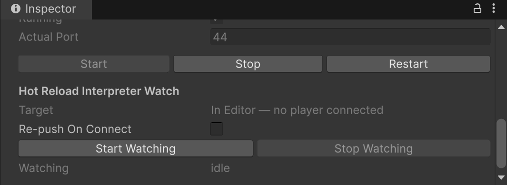

# Reloading Code

Update C# methods with the `[CodeReload]` attribute without restarting Play Mode in the editor or rebuilding the Player. Two backends are supported:

| Command | Backend | Where | Language | Pipeline server needed in player |
|---------|---------|-------|----------|----------------------------------|
| `reload_file` | `Assembly.Load` (default) | Editor Play Mode, Desktop Mono dev builds | Full C# | yes |
| `reload_file_editor_interpreter`, `reload_file_player_interpreter` | IlInterpreter | Any dev build, **including IL2CPP** | A C# subset (see [constraints](#interpreter-constraints)) | no |

The watch UI and device pushes always use the interpreter: an IL2CPP player has no Roslyn and no `Assembly.Load`, so the editor compiles and the device interprets. Code reload is gated to the editor and development builds (`UNITY_EDITOR || DEVELOPMENT_BUILD || ENABLE_RUNTIME_PIPELINE`) — the whole `Unity.Pipeline` assembly carries that define constraint, so a release build contains none of it unless you opt in with `ENABLE_RUNTIME_PIPELINE` (see `runtime-setup.md`). `[CodeReload]` itself lives in the unconstrained `Unity.Pipeline.Attributes` assembly, so a tagged method still compiles for a release build; it simply runs its original body, with no dispatch prologue woven in.

## Tagging a method

Tag the method you want to reload with `[CodeReload]`:

```csharp
using Unity.Pipeline.CodeReload;
using UnityEngine;

public class Spinner : MonoBehaviour
{
    public float rotationSpeed = 90f;

    [CodeReload]
    public void Update()
    {
        transform.Rotate(Vector3.up, rotationSpeed * Time.deltaTime);
    }
}
```

The attribute must be there before entering Play Mode or building a player, because the dispatch check is woven in at compile time (see [How it works](#how-it-works)). Edit the body of `Update`, then apply the file with one of the commands below. The running instance picks up the new body.

**Constraints.** The `[CodeReload]` method must be **`public`** (instance **or static**) and must return **`void` or `System.Collections.IEnumerator`** (a coroutine). Methods returning anything else are skipped at build time with a warning. The `Assembly.Load` backend adds one more rule, described in its section: the body may only touch public members of its host type.

### Supported changes

**New methods:** a reload can declare a method the compiled type doesn't have yet and call it from a reloaded body (instance and static methods, expression bodies included; not generics, properties, or fields). A new method cannot be a reload *entry point* — nothing compiled calls it until the next real compile — so tagging it `[CodeReload]` registers nothing for it (the reload response says so) while the rest of the file still applies.

**Method groups and delegates:** a reloaded body can pass a method as a callback — `_root.Add(new Button(Click))`, `button.clicked += Click`, `RegisterCallback<ClickEvent>(OnClick)` — whether the method already exists compiled or was just added, and event `-=` unsubscribes as expected. Lambdas and closures work too, and delegate *values* combine (`a += b` on an `Action` local/field). Limits: at most 4 delegate parameters and no ref/out parameters. One caveat for a method group over a *new* method: the receiver is evaluated when the delegate fires, not captured at subscription, and `-=` of such a group won't match the `+=`.

**Coroutines:** a `[CodeReload] IEnumerator` method picks up the new body at iterator **creation** — each `StartCoroutine` call uses the latest reload, while coroutines already running keep executing the body they were created from (use `[OnCodeReload]` to stop/restart long-lived ones). `yield return null`, `WaitForSeconds`, and nested coroutines all work; `IEnumerable`/generic iterator returns are not supported. Two caveats: an exception thrown inside a reloaded coroutine body surfaces from the coroutine scheduler with no automatic fallback to the original body (unlike void methods), and on the interpreter backend a `try/finally` around a `yield` runs its `finally` on the normal path and on `Dispose`, but **not** when the body throws. Coroutines are the main use case for the `[OnCodeReload]` callbacks described below.

## Reload callbacks — `[OnCodeReload]`

Tag a **parameterless instance method** with `[OnCodeReload]` to run code after a reload lands — a place to re-initialize state the swapped code depends on (think a domain-reload-free `OnEnable`):

```csharp
[OnCodeReload]
void OnCodeReloaded()
{
    StopAllCoroutines();
    StartCoroutine(MainLoop()); // restart so the loop picks up the new body
}
```

It fires once per reload that changes at least one method on the declaring type, on **every live instance** (`UnityEngine.Object`-derived types only), on the main thread. Exceptions are logged, not propagated. Both backends and the watcher trigger it. Typical uses: restarting long-lived coroutines, disabling and re-enabling MonoBehaviours, and refreshing caches computed by the old code.

## `Assembly.Load` backend: the `reload_file` command

This backend compiles the edited C# in the process that runs it, so reloading in a player does not need a running editor. It does need the runtime Pipeline server in the player, since the command arrives over HTTP.

```bash
unity command reload_file "<absolute path>/Spinner.cs"

# Emit debug symbols so breakpoints bind (compiles unoptimized):
unity command reload_file "<absolute path>/Spinner.cs" --pdb
```

`reload_file` parameters:

| Arg | Default | Meaning |
|-----|---------|---------|
| `filename` | *(required)* | Source file containing `[CodeReload]` methods. |
| `timeout` | `30000` | Compilation timeout (ms). |
| `assemblyDir` | `null` | Optional directory to also save the compiled assembly to disk (default: in-memory only). |
| `pdb` | `false` | Emit a portable PDB mapped to the original source so debugger breakpoints bind. Compiles unoptimized. |

**Public members only.** The reloaded body may only access public members of its host type. The compiled code loads as a separate assembly and Mono enforces accessibility, so a private field or method would fail at dispatch; the reload rejects it up front with the offending members listed.

## Interpreter backend: the `reload_file_*_interpreter` commands

The editor compiles the edited file to IL, and the IlInterpreter runs that IL where the reload lands: in the editor process, or in a connected player. No `Assembly.Load` is involved, so this backend works in IL2CPP players. Both commands compile in the editor, so reloading a player needs the editor running and the player connected.

### `reload_file_editor_interpreter`

Same as `reload_file`, but the reloaded methods run through the interpreter in the editor process. Use it to check that an edit stays within the interpreter's subset and host surface before pushing it to a device.

```bash
unity command reload_file_editor_interpreter "<absolute path>/Spinner.cs"
```

| Arg | Default | Meaning |
|-----|---------|---------|
| `filename` | *(required)* | Source file containing `[CodeReload]` methods. |
| `timeout` | `30000` | Compilation timeout (ms). |
| `assemblyDir` | `null` | Optional directory to also save the compiled IL to disk (default: in-memory only). |
| `pdb` | `false` | Emit a portable PDB mapped to the original source. Runtime errors already report source lines on this backend, so this only matters if you also want the `.pdb` on disk. |

The public-members-only constraint of `reload_file` does not apply: the interpreter reaches private members by reflection.

### `reload_file_player_interpreter`

Compiles a file's (or a folder's) `[CodeReload]` methods in the editor and pushes the IL to connected development players over PlayerConnection (the Profiler's channel, so no open port is needed and it tunnels over USB). Folders are walked recursively; a `.cs` file is only compiled if it mentions `CodeReload`, and files that don't are skipped rather than reported as errors.

```bash
# Compile a file's [CodeReload] methods and push to every connected player
unity command reload_file_player_interpreter "Assets/Scripts/Player.cs"

# Push a whole folder, targeting one player by id (-1 = broadcast, the default)
unity command reload_file_player_interpreter "Assets/Scripts" --player 2
```

| Arg | Default | Meaning |
|-----|---------|---------|
| `filename` | *(required)* | Source `.cs` file or a folder containing `[CodeReload]` methods (e.g. `Assets/pong.cs` or `Assets/Scripts`). |
| `player` | `-1` | Target connected player id. `-1` broadcasts to all connected players. |

Points to know:

- The push compiles with the **player's** preprocessor defines, not the editor's.
- The player needs the runtime Pipeline driver enabled (see [Runtime connection & setup](runtime-setup.md)); the HTTP server is not required.
- The response reports the compile result and any host-surface members the pushed code uses that the player does not expose (see [Available APIs](#interpreter-constraints)). The player acks the apply asynchronously to the editor console.
- Unlike the watcher, the command pushes every tagged method in the file, not just the ones that changed. That is the escape hatch when the connected player was not built from the sources you are editing.

### Interpreter constraints

The `Assembly.Load` backend runs plain C# — anything Roslyn compiles works. The interpreter backend does not: it executes a **C# subset** against a **fixed host surface**. The subset is checked before the code runs; the host surface only bites at runtime, on a device.

**Language subset.** The shipped Roslyn analyzer (diagnostics **MS002–MS023**) marks violations in your IDE, on `[CodeReload]` method bodies only. Not supported:

- `await` / `Task`, `try`/`catch`/`finally`, `lock`, LINQ query syntax (`from x in …`), `checked`
- `decimal`, `dynamic`, reflection types (`Type`, `MethodInfo`, …), threading types
- `ref`/`out`/`in` parameters, `ref` returns and locals, multi-dimensional arrays (`int[,]` — jagged `int[][]` is fine), generic methods
- declaring static fields, value-type nullables (`T?`), new type declarations inside the file, `yield` in a local function

`long`, `ulong`, and `double` work (the VM runs them in 64-bit slots). Lambdas, closures, delegates, `goto`, string interpolation, and coroutine `yield` all work — see the delegate and coroutine notes above for their edges.

**Available APIs.** Interpreted code can only call the UnityEngine/BCL members the interpreter exposes, plus the reloaded type's own members. In the editor, missing members bind on demand; on a device they cannot (IL2CPP strips unreferenced code), so an unexposed member throws when the reloaded code reaches it. A device push checks this up front and lists the missing members as warnings in the push response.

### Watching for changes

Instead of running `reload_file_player_interpreter` or `reload_file_editor_interpreter` by hand, let the editor watch for saves: **Window → Pipeline → Settings… → Code Reload Interpreter Watch → Start Watching**. The watch covers the whole Assets tree; a saved `.cs` only compiles if it mentions `CodeReload`.



Each save picks its target automatically:

- **A development player is connected** (Autoconnect Profiler, or attached via Profiler/Console) → the save compiles in the editor and is pushed to every connected player over PlayerConnection, always on the interpreter backend.
- **No player** → the save applies in this editor process, also on the interpreter backend.

Plugging in or disconnecting a device mid-watch reroutes the next save; no restart needed.

The workflow: start the watch, enter Play Mode, edit `[CodeReload]` bodies, save. Points to know:

- **Auto-refresh is off while watching**, so a save reloads instead of triggering a domain reload. Other assets won't import until you refresh manually (Cmd/Ctrl+R). **Stop Watching** restores your setting.
- Only methods that **changed since the watch started** reload; untouched ones keep running compiled.
- The watch **survives domain reloads**, re-applies reloads that a Play Mode domain reload wiped, and re-pushes state to a player that reconnects (a restarted player boots the original code) — governed by the **Re-push On Connect** setting.
- The inspector shows liveness: watcher event count, last apply, and the resolved target. Compile errors and binding warnings land in the Console.

To push once without a watch, run [`reload_file_player_interpreter`](#reload_file_player_interpreter) directly.

## How it works

Every `[CodeReload]` method gets a small check woven in when your project builds: on each call it runs the latest reloaded body if one exists, otherwise the original. That is why edits apply without touching call sites, and why a reload only ever changes tagged methods.

An applied reload compiles the edited source **in memory**; nothing is written to disk unless you pass `assemblyDir`. The result then either loads next to the original assembly (`Assembly.Load` backend, Mono only) or is executed by the interpreter (works everywhere, including IL2CPP).

## Supporting commands

- `codereload_status` — list which methods currently have a reload applied.
- `cleanup_codereload` — delete saved reload assemblies and revert every method to its compiled body.

## See also

- [Runtime connection & setup](runtime-setup.md) — enabling code reload in a Player build.
- [Command reference](commands/runtime.md)
